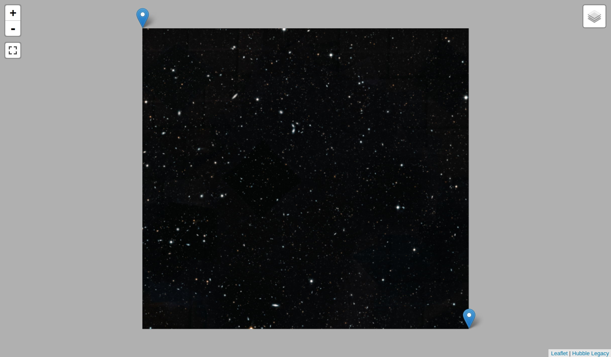

# [HubbleLegacyField](https://anthonyblackham.com/HubbleLegacyField/)

an interactive tiled map of the latest cropped [hubble legacy map](http://hubblesite.org/news_release/news/2019-17) using gdal2tiles

